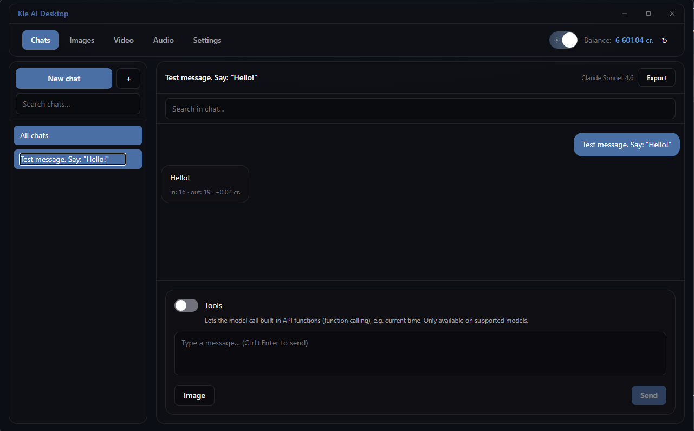
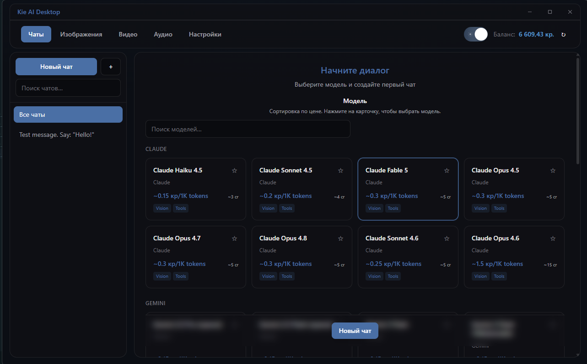
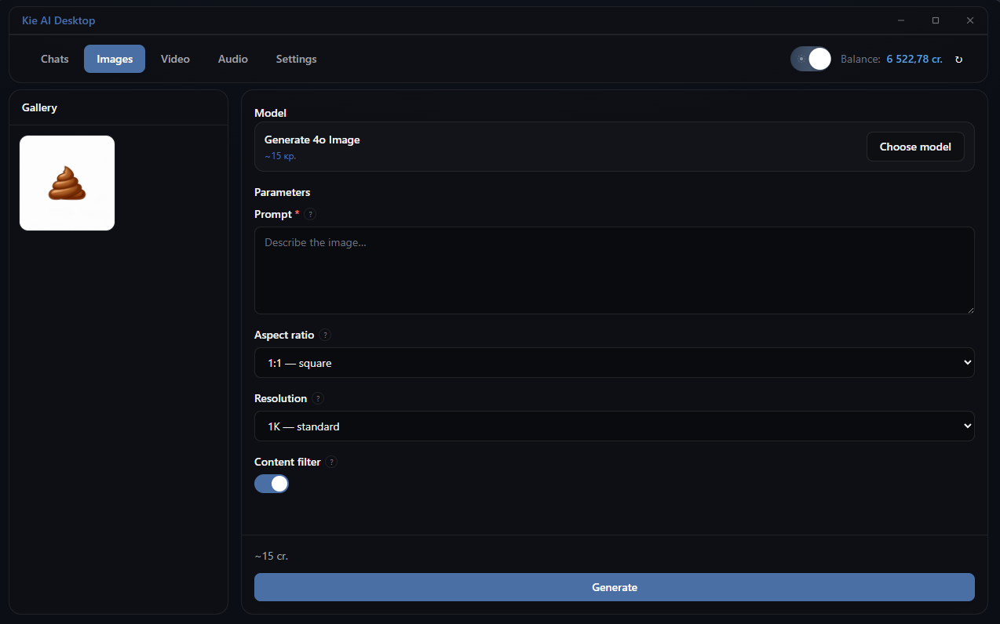
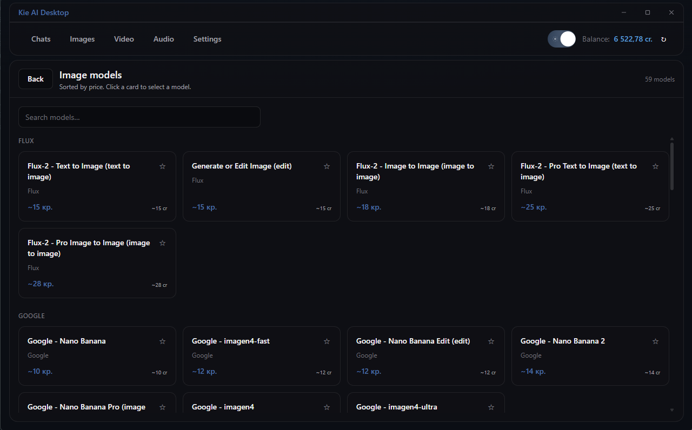

<p align="center">
  
</p>

<h1 align="center">Kie AI Desktop</h1>

<p align="center">
  <strong>Native Windows desktop client for <a href="https://kie.ai">kie.ai</a></strong><br />
  AI chats · image · video · audio generation · model catalog · session limits
</p>

<p align="center">
  <a href="https://github.com/iac-iac-iac/Kie_AI/releases/latest"></a>
  <a href="https://github.com/iac-iac-iac/Kie_AI/actions/workflows/release.yml"></a>
</p>

<p align="center">
  <a href="#features">Features</a> ·
  <a href="#screenshots">Screenshots</a> ·
  <a href="#download">Download</a> ·
  <a href="#development">Development</a> ·
  <a href="#credits">Credits</a>
</p>

---

**Kie AI Desktop** — open-source клиент для [kie.ai](https://kie.ai) на Windows 11.  
Стек: **Tauri 2** + **React** + **TypeScript** + **Python FastAPI** sidecar.

> Keywords: `kie.ai` `desktop app` `Tauri` `AI chat` `image generation` `video generation` `audio generation` `Windows` `FastAPI` `React`

## Features

| Area | Description |
|------|-------------|
| **Chats** | Multi-model AI chat with folders, search, export, vision & tools |
| **Images** | Text/image-to-image generation with dynamic model forms |
| **Video** | Text/image-to-video models and task polling |
| **Audio** | Music & speech models (Suno and more) |
| **Model catalog** | Grid of models sorted by estimated credits |
| **Settings** | API key (Windows Credential Manager), HTTP/SOCKS5 proxy, themes RU/EN |
| **Session limit** | Per-session credit cap with live balance bar |
| **Backup** | Export/import SQLite database and media |
| **Updater** | Signed auto-updates via GitHub Releases |

## Screenshots

### Chats

<p align="center">
  
</p>

### Model catalog (new chat)

<p align="center">
  
</p>

### Image generation

<p align="center">
  
</p>

### Image model catalog

<p align="center">
  
</p>

## Download

**[Latest release (Windows x64 installer)](https://github.com/iac-iac-iac/Kie_AI/releases/latest)**

1. Download `Kie.AI.Desktop_*_x64-setup.exe`
2. Install and launch — sidecar starts automatically (first run may take ~20 s)
3. **Settings → General** → paste your [kie.ai](https://kie.ai) API key
4. If needed, enable **Proxy** (`http://` or `socks5://`) for restricted networks

> Unsigned builds may trigger Windows SmartScreen on first run.

## Prerequisites (development)

- [Node.js](https://nodejs.org/) 20+
- [Rust](https://www.rust-lang.org/tools/install) (Tauri)
- [Python](https://www.python.org/) 3.11+
- [WebView2](https://developer.microsoft.com/microsoft-edge/webview2/) (pre-installed on Windows 11)

## Development

```powershell
# Sidecar
cd apps/sidecar
python -m venv .venv
.\.venv\Scripts\Activate.ps1
pip install -e ".[dev]"

# Desktop
cd ..\desktop
npm install

# Run sidecar + Tauri dev (from repo root)
cd ..\..
.\scripts\dev.ps1
```

### Production build

```powershell
.\scripts\build.ps1
# Installer: apps\desktop\src-tauri\target\release\bundle\nsis\
```

## Environment

| Variable | Description |
|----------|-------------|
| `KIE_API_KEY` | Dev fallback API key (production → Credential Manager) |
| `KIE_DATA_DIR` | Data directory (default `%APPDATA%\KieAI`) |
| `VITE_SIDECAR_URL` | Sidecar URL (default `http://127.0.0.1:18765`) |

## Project structure

```
apps/desktop/   Tauri 2 + React + TypeScript UI
apps/sidecar/   Python FastAPI backend (PyInstaller onefile)
images/         README screenshots & branding
docs/           Architecture & roadmap
scripts/        dev.ps1, build.ps1, build-sidecar.ps1
```

## Documentation

- [Architecture](docs/02-architecture.md)
- [Preliminary plan](docs/01-preliminary-plan.md)
- [v1.1 roadmap](docs/03-v1.1-roadmap.md)

## Credits

| | |
|---|---|
| **Author** | [iac](https://github.com/iac-iac-iac) |
| **Contact** | [i@iac-iac.ru](mailto:i@iac-iac.ru) |
| **Repository** | https://github.com/iac-iac-iac/Kie_AI |

In-app: **Settings → Credits / Авторы**
