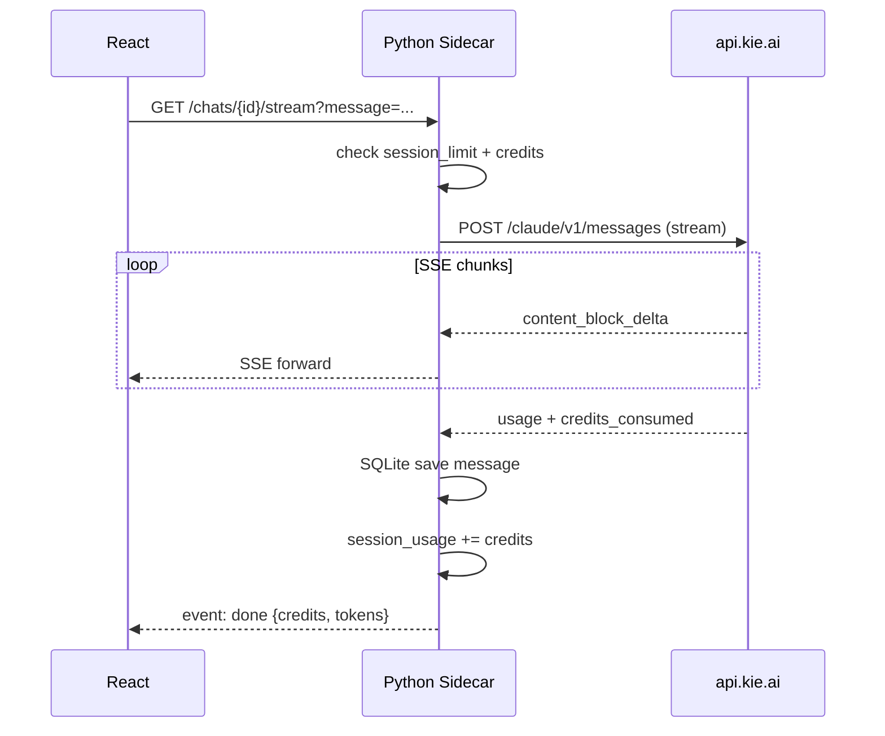
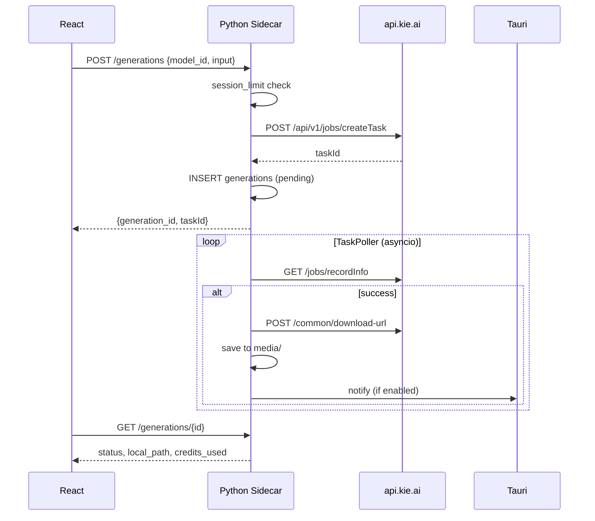

# Kie AI Desktop — архитектура (v1.0)

> Статус: **согласовано** (22.06.2026)  
> Предыдущий документ: [01-preliminary-plan.md](./01-preliminary-plan.md)

---

## 1. Зафиксированные решения

| Решение | Значение |
|---------|----------|
| Платформа | Windows 11 |
| UI | **Tauri 2** + **React 19** + **TypeScript** |
| Стили | Tailwind CSS 4, shadcn/ui, framer-motion (glass) |
| Backend | **Python 3.12+** sidecar (FastAPI + httpx + SQLite) |
| i18n | ru + en (`react-i18next`) |
| Прокси | HTTP/HTTPS/SOCKS5 в настройках **с первого дня** |
| MVP-модели | См. §5 (7 моделей) |
| Аудио | Фаза 2 |

---

## 2. Высокоуровневая схема

```
┌──────────────────────────────────────────────────────────────────┐
│  Tauri Shell (Rust)                                               │
│  • Запуск/остановка Python sidecar                                │
│  • Windows Toast notifications                                    │
│  • Keyring: API key → env sidecar (не в WebView)                  │
│  • Открытие файлов / reveal in Explorer                           │
└────────────────────────────┬─────────────────────────────────────┘
                             │ WebView2
┌────────────────────────────▼─────────────────────────────────────┐
│  React App (Vite)                                                 │
│  Tabs: Chats | Images | Video | Settings                          │
│  Global: BalanceBar, SessionCreditsCounter                          │
└────────────────────────────┬─────────────────────────────────────┘
                             │ HTTP localhost (127.0.0.1)
                             │ REST + SSE (chat stream)
┌────────────────────────────▼─────────────────────────────────────┐
│  Python Sidecar (FastAPI, uvicorn)                                 │
│  KieClient │ TaskPoller │ ModelRegistry │ SQLite │ MediaStore      │
└────────────────────────────┬─────────────────────────────────────┘
         │ proxy (optional)  │
         ▼                   ▼
  api.kie.ai          kieai.redpandaai.co (file upload)
```

### 2.1 Почему localhost HTTP, а не только Tauri commands

| Потребность | Решение |
|-------------|---------|
| Chat SSE streaming | Прямой `EventSource` / `fetch` stream на sidecar |
| Загрузка файлов (multipart) | FastAPI `UploadFile` без сериализации через IPC |
| Большие ответы (галерея) | Обычный REST, проще отладка |

Tauri commands используются для: получения порта sidecar, keyring, native dialogs, notifications.

### 2.2 Безопасность API-ключа

```
[Settings UI] → Tauri invoke("set_api_key") → Windows Credential Manager
[App start]   → Tauri читает key → передаёт в sidecar через env KIE_API_KEY
[WebView]     → НИКОГДА не получает ключ; только localhost без auth token
                (sidecar слушает только 127.0.0.1)
```

Sidecar при старте проверяет, что bind только на `127.0.0.1` и порт случайный (ephemeral).

---

## 3. Структура репозитория

```
Kie_AI/
├── apps/
│   ├── desktop/                 # Tauri + React
│   │   ├── src/                 # React UI
│   │   │   ├── app/             # routes, layout
│   │   │   ├── features/        # chats, images, video, settings
│   │   │   ├── components/      # shared UI (glass)
│   │   │   ├── lib/             # api-client (localhost), i18n
│   │   │   └── styles/
│   │   ├── src-tauri/           # Rust: sidecar lifecycle, keyring
│   │   ├── package.json
│   │   └── tauri.conf.json
│   └── sidecar/                 # Python backend
│       ├── pyproject.toml
│       ├── kie_sidecar/
│       │   ├── main.py          # FastAPI app, lifespan
│       │   ├── config.py        # paths, proxy, limits
│       │   ├── api/             # REST routers
│       │   │   ├── account.py
│       │   │   ├── chats.py
│       │   │   ├── generations.py
│       │   │   ├── models.py
│       │   │   └── settings.py
│       │   ├── kie/             # kie.ai integration
│       │   │   ├── client.py
│       │   │   ├── chat.py
│       │   │   ├── jobs.py
│       │   │   ├── files.py
│       │   │   └── errors.py
│       │   ├── services/
│       │   │   ├── task_poller.py
│       │   │   ├── media_store.py
│       │   │   ├── session_limits.py
│       │   │   └── pricing.py
│       │   ├── db/
│       │   │   ├── schema.sql
│       │   │   └── repository.py
│       │   └── models/          # Pydantic + registry JSON
│       │       └── registry/
│       │           ├── chat/
│       │           ├── image/
│       │           └── video/
│       └── tests/
├── docs/
├── scripts/
│   ├── dev.ps1                  # запуск desktop + sidecar
│   └── build.ps1
└── README.md
```

---

## 4. Локальное хранилище

### 4.1 Пути (Windows)

| Назначение | Путь |
|------------|------|
| База SQLite | `%APPDATA%\KieAI\data\kie.db` |
| Медиа (галерея) | `%APPDATA%\KieAI\media\{images,videos}\` |
| Логи sidecar | `%APPDATA%\KieAI\logs\sidecar.log` |
| Кэш прайса | `%APPDATA%\KieAI\cache\pricing.json` |

### 4.2 Схема SQLite

```sql
-- settings: key-value (proxy, theme, locale, notifications, session_limit)
CREATE TABLE settings (
  key TEXT PRIMARY KEY,
  value TEXT NOT NULL
);

CREATE TABLE chat_folders (
  id TEXT PRIMARY KEY,
  name TEXT NOT NULL,
  sort_order INTEGER DEFAULT 0,
  created_at TEXT NOT NULL
);

CREATE TABLE chats (
  id TEXT PRIMARY KEY,
  folder_id TEXT REFERENCES chat_folders(id),
  title TEXT NOT NULL,
  model_id TEXT NOT NULL,
  created_at TEXT NOT NULL,
  updated_at TEXT NOT NULL
);

CREATE TABLE messages (
  id TEXT PRIMARY KEY,
  chat_id TEXT NOT NULL REFERENCES chats(id),
  role TEXT NOT NULL,           -- user | assistant | tool
  content_json TEXT NOT NULL,   -- multimodal blocks
  tokens_in INTEGER,
  tokens_out INTEGER,
  credits REAL,
  created_at TEXT NOT NULL
);

CREATE TABLE generations (
  id TEXT PRIMARY KEY,
  type TEXT NOT NULL,           -- image | video
  model_id TEXT NOT NULL,
  task_id TEXT,
  status TEXT NOT NULL,         -- pending | running | success | failed
  prompt TEXT,
  params_json TEXT,
  credits_used REAL,
  remote_url TEXT,
  local_path TEXT,
  error_msg TEXT,
  created_at TEXT NOT NULL,
  completed_at TEXT
);

CREATE TABLE session_usage (
  id INTEGER PRIMARY KEY CHECK (id = 1),
  credits_spent REAL DEFAULT 0,
  started_at TEXT NOT NULL
);
```

---

## 5. MVP — каталог моделей

Прайс-hint хранится в `registry/*.json` (ручное обновление из [kie.ai/pricing](https://kie.ai/pricing)); фактические кредиты — из ответа API.

### 5.1 Чаты (2 модели)

#### Claude Sonnet 4.6

| Поле | Значение |
|------|----------|
| `model_id` | `claude-sonnet-4-6` |
| Endpoint | `POST https://api.kie.ai/claude/v1/messages` |
| Streaming | SSE (`stream: true`) |
| Tools | `tools[]` + `input_schema` |
| Credits | `credits_consumed` в ответе |
| Tokens | `usage.input_tokens`, `usage.output_tokens` |
| Docs | [claude-sonnet-4-6](https://docs.kie.ai/market/claude/claude-sonnet-4-6.md) |

#### GPT 5.2 (multimodal)

| Поле | Значение |
|------|----------|
| `model_id` | `gpt-5-2` |
| Endpoint | `POST https://api.kie.ai/gpt-5-2/v1/chat/completions` |
| Vision | `content[]` с `type: image_url` |
| Tools | `web_search` function |
| Params | `reasoning_effort`: low \| high |
| Tokens | `usage.prompt_tokens`, `completion_tokens` |
| Docs | [gpt-5-2](https://docs.kie.ai/market/chat/gpt-5-2.md) |

> Для изображений в чате: сначала `File Upload API` → `fileUrl` в `image_url.url`.

### 5.2 Изображения (3 модели)

Все через unified jobs API.

| model_id | Ключевые параметры `input` |
|----------|---------------------------|
| `flux-2/flex-text-to-image` | prompt, aspect_ratio, resolution (1K/2K), nsfw_checker |
| `google/nano-banana` | prompt, output_format, aspect_ratio, nsfw_checker |
| `gpt-image/1-5-text-to-image` | prompt, aspect_ratio (см. docs) |

| Общее | |
|-------|---|
| Create | `POST /api/v1/jobs/createTask` |
| Poll | `GET /api/v1/jobs/recordInfo?taskId=` |
| Download | `POST /api/v1/common/download-url` → скачать в `media/images/` |

### 5.3 Видео (2 модели)

| model_id | Ключевые параметры `input` |
|----------|---------------------------|
| `kling-2.6/text-to-video` | prompt, sound, aspect_ratio, duration (5/10) |
| `bytedance/seedance-1.5-pro` | prompt, input_urls (0–2), aspect_ratio, resolution, duration (4–12), fixed_lens, generate_audio |

| Общее | |
|-------|---|
| Create / Poll | как у изображений |
| Локально | `media/videos/` |

---

## 6. Python Sidecar — внутренний API

Base: `http://127.0.0.1:{PORT}/api/v1`

### 6.1 Account

| Method | Path | Описание |
|--------|------|----------|
| GET | `/account/credits` | Прокси → `GET /api/v1/chat/credit` |
| GET | `/account/session-usage` | `{ spent, limit, remaining }` |
| POST | `/account/test-connection` | Проверка ключа |

### 6.2 Settings

| Method | Path | Описание |
|--------|------|----------|
| GET | `/settings` | theme, locale, notifications, proxy, session_limit |
| PATCH | `/settings` | Обновление (proxy пересоздаёт httpx client) |

**Прокси (settings):**

```json
{
  "proxy": {
    "enabled": false,
    "url": "socks5://127.0.0.1:1080"
  }
}
```

Реализация в `httpx.AsyncClient(proxy=..., trust_env=False)`.

### 6.3 Chats

| Method | Path | Описание |
|--------|------|----------|
| GET | `/chats/folders` | Список папок |
| POST | `/chats/folders` | Создать папку |
| GET | `/chats` | Список чатов (`?folder_id=`) |
| POST | `/chats` | Новый чат |
| GET | `/chats/{id}/messages` | История |
| POST | `/chats/{id}/messages` | Отправить (non-stream) |
| GET | `/chats/{id}/stream` | **SSE** — стрим ответа |
| POST | `/chats/upload` | multipart → File Upload API → URL |

### 6.4 Generations (images + video)

| Method | Path | Описание |
|--------|------|----------|
| GET | `/models?type=image\|video` | ModelRegistry + price hints |
| GET | `/models/{id}/schema` | JSON Schema для dynamic form |
| POST | `/generations` | createTask + enqueue poll |
| GET | `/generations` | Локальная галерея (`?type=`) |
| GET | `/generations/{id}` | Статус + метаданные |
| GET | `/generations/{id}/file` | Отдача локального файла |
| DELETE | `/generations/{id}` | Удалить запись + локальный файл |

### 6.5 Events (опционально, v1.1)

`GET /events` — SSE для UI: `generation.completed`, `credits.updated`.

В MVP достаточно polling статуса с фронта + callback в TaskPoller → Tauri notification.

---

## 7. Потоки данных

### 7.1 Chat (streaming)



### 7.2 Image/Video generation



### 7.3 Session credit limit

```python
# Перед любой платной операцией:
if settings.session_limit_enabled:
    if session.credits_spent + estimated_cost > settings.session_limit:
        raise SessionLimitExceeded()
```

После операции — `credits_spent += actual_credits` (из ответа API, не estimate).

---

## 8. ModelRegistry

Каждая модель — JSON в `apps/sidecar/kie_sidecar/models/registry/`:

```json
{
  "id": "kling-2.6/text-to-video",
  "category": "video",
  "display_name": "Kling 2.6 Text to Video",
  "api_type": "jobs",
  "create_path": "/api/v1/jobs/createTask",
  "model_field": "kling-2.6/text-to-video",
  "price_hint_credits": 200,
  "parameters": [
    {
      "name": "prompt",
      "type": "textarea",
      "required": true,
      "max_length": 1000
    },
    {
      "name": "duration",
      "type": "select",
      "options": ["5", "10"],
      "default": "5"
    }
  ],
  "docs_url": "https://docs.kie.ai/market/kling/text-to-video.md"
}
```

UI рендерит форму из `parameters[]`; sidecar валидирует через Pydantic перед отправкой в kie.ai.

---

## 9. Прокси (РФ)

| Компонент | Поведение |
|-----------|-----------|
| `api.kie.ai` | httpx proxy из настроек |
| `kieai.redpandaai.co` (upload) | тот же proxy |
| UI | Поля: enabled, URL (`http://`, `https://`, `socks5://`), кнопка «Проверить» |
| Dev | `dev.ps1` может читать `$env:HTTPS_PROXY` как fallback |

При смене proxy — пересоздание `AsyncClient` без рестарта приложения.

---

## 10. UI — структура экранов

### 10.1 Layout

```
┌─────────────────────────────────────────────────────────┐
│ [Kie AI]  Chats | Images | Video | Settings    💳 1 234 ↻│  ← glass header
├─────────────────────────────────────────────────────────┤
│                                                         │
│                    {active tab content}                 │
│                                                         │
├─────────────────────────────────────────────────────────┤
│ Session: 12.5 / 100 cr. (optional limit bar)            │  ← если лимит вкл.
└─────────────────────────────────────────────────────────┘
```

### 10.2 Design tokens (glass)

| Token | Значение (dark default) |
|-------|-------------------------|
| `--glass-bg` | `rgba(15, 15, 20, 0.65)` |
| `--glass-border` | `rgba(255, 255, 255, 0.08)` |
| `--blur` | `backdrop-blur-xl` |
| `--accent` | градиент violet → cyan |

Тема light — инверсия opacity; переключатель в Settings.

---

## 11. Tauri (Rust) — обязанности

| Модуль | Функция |
|--------|---------|
| `sidecar.rs` | Spawn `kie-sidecar.exe`, передать `KIE_API_KEY`, `KIE_DATA_DIR`, `PORT` |
| `keyring.rs` | `keyring` crate → service `kie-ai-desktop` |
| `notify.rs` | `tauri-plugin-notification` при событии от sidecar (HTTP callback на localhost или stdin) |
| `paths.rs` | `%APPDATA%\KieAI` |

`tauri.conf.json`:

```json
{
  "bundle": {
    "externalBin": ["bin/kie-sidecar"]
  }
}
```

Сборка: PyInstaller / `python -m build` → `kie-sidecar.exe` в `src-tauri/bin/`.

---

## 12. Зависимости

### 12.1 Frontend (`apps/desktop`)

- `react`, `react-router-dom`
- `@tanstack/react-query` — кэш API, refetch баланса
- `react-i18next`
- `tailwindcss`, `@radix-ui/*` (shadcn)
- `framer-motion`
- `react-markdown`, `shiki` — чат
- `@tauri-apps/api`, `tauri-plugin-notification`, `tauri-plugin-dialog`

### 12.2 Sidecar (`apps/sidecar`)

- `fastapi`, `uvicorn[standard]`
- `httpx[socks]` — SOCKS5 proxy
- `pydantic`, `pydantic-settings`
- `aiosqlite`
- `sse-starlette` — SSE endpoints
- `python-multipart` — upload
- `structlog`

---

## 13. Обработка ошибок kie.ai

| Code | Действие в UI |
|------|---------------|
| 401 | «Неверный API-ключ» → Settings |
| 402 | «Недостаточно кредитов» |
| 429 | Retry с backoff, toast «Слишком много запросов» |
| 501 | «Генерация не удалась», показать `msg` |
| 455 | «Сервис на обслуживании» |
| Network | «Проверьте сеть или прокси» |

---

## 14. Фазы реализации

| Фаза | Deliverable | Критерий готовности |
|------|-------------|---------------------|
| **F1** | Scaffold + sidecar + settings + proxy + balance | Баланс отображается, ключ сохраняется |
| **F2** | Chats: Claude + GPT, streaming, folders | Отправка/история, credits в сообщении |
| **F3** | Images: 3 модели, gallery, download | Файл в локальной галерее |
| **F4** | Video: 2 модели, player | Воспроизведение mp4 из gallery |
| **F5** | Notifications, session limit, i18n, polish | MVP installer `.msi`/`.exe` |

---

## 15. Dev workflow (Windows PowerShell)

```powershell
# Terminal 1: sidecar (dev)
cd apps/sidecar
$env:KIE_API_KEY = "..."
$env:KIE_DATA_DIR = "$env:APPDATA\KieAI"
uvicorn kie_sidecar.main:app --host 127.0.0.1 --port 18765 --reload

# Terminal 2: Tauri dev
cd apps/desktop
$env:SIDEcar_URL = "http://127.0.0.1:18765"
npm run tauri dev
```

`scripts/dev.ps1` — объединяет оба процесса.

---

## 16. Следующий шаг

После утверждения архитектуры — **F1: scaffold репозитория** (`apps/desktop`, `apps/sidecar`, базовый UI shell с вкладками и BalanceBar).
