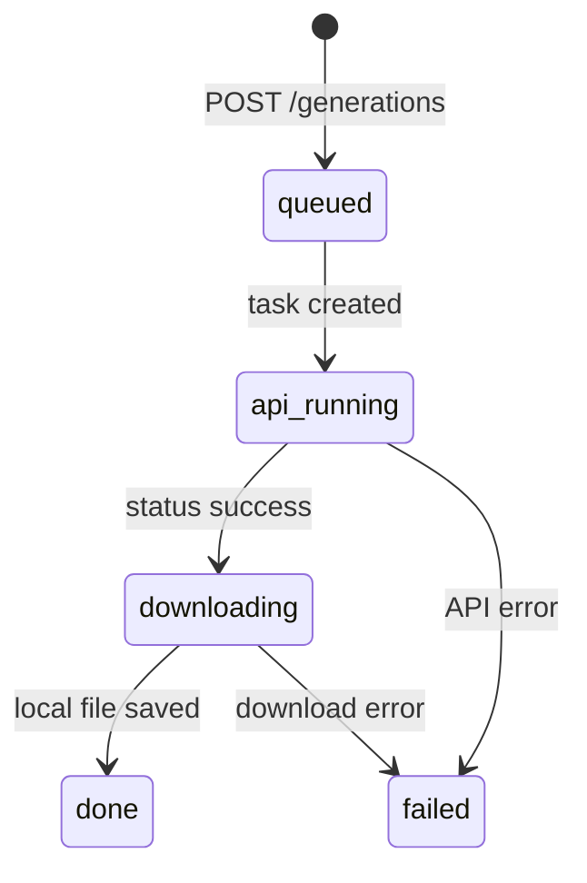
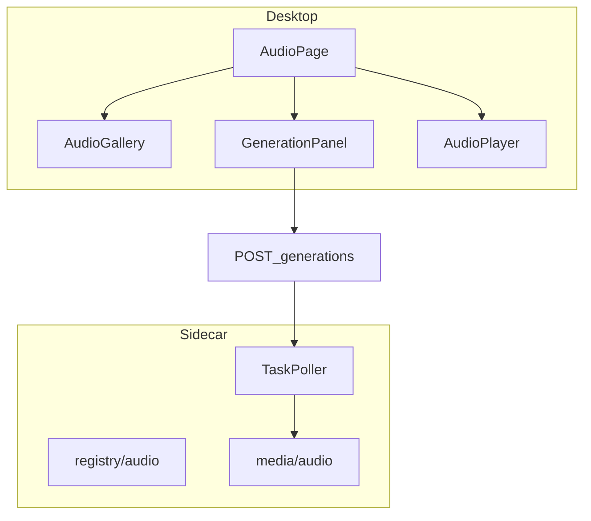

# Kie AI Desktop — roadmap v1.1

> Версия документа: **1.0**  
> Дата: **22.06.2026**  
> Статус: **план к реализации** (после MVP / F5)  
> Предыдущие документы: [01-preliminary-plan.md](./01-preliminary-plan.md), [02-architecture.md](./02-architecture.md)

---

## 1. Цель v1.1

Расширить MVP до полноценного ежедневного инструмента: меньше ручной работы при генерации, прозрачная стоимость, удобные чаты, вкладка аудио, меньше polling, проще поддержка и обновление приложения.

**Не входит в v1.1** (отложить на v1.2+):

- Синхронизация с [kie.ai/logs](https://kie.ai/logs) (задачи вне приложения)
- System tray / сворачивание в трей
- Пресеты промптов (отдельная фича, если не успеем в «улучшение чатов»)

---

## 2. Текущая база (что уже есть)

| Область | Реализация |
|---------|------------|
| MVP вкладки | Chats, Images, Video, Settings |
| Каталог моделей | 50 JSON в `apps/sidecar/kie_sidecar/models/registry/` |
| `estimate_credits` | Поле в registry JSON, используется в session limit на sidecar |
| `price_hint` | Отображается в ModelPicker / ModelSelectDropdown |
| Генерации | `GenerationRecord` с `params`, `prompt`, `credits_used`, `local_path` |
| Polling | `useGenerationPoll` (2.5 с) + TaskPoller на sidecar |
| API-ключ | Keyring (`keyring_store.rs`), `useApiReady` (keyring + credits 401) |
| Чаты | Streaming, vision, tools, папки, drag-and-drop чатов |
| Уведомления | `tauri-plugin-notification` при завершении генерации |
| i18n | ru + en |
| Installer | PyInstaller sidecar + Tauri NSIS (F5) |

---

## 3. Фазы и приоритет

Рекомендуемый порядок работ — от быстрой ценности к инфраструктуре.

```mermaid
flowchart LR
  subgraph P1 [Фаза 1 — UX генерации]
    A1[Оценка стоимости]
    A2[Прогресс генерации]
    A3[Повтор / вариация]
    A4[Избранные модели]
    A5[Открыть папку]
  end
  subgraph P2 [Фаза 2 — Настройки и доступ]
    B1[Удаление API-ключа]
    B2[Горячие клавиши]
    B3[Диагностика]
    B4[Резервное копирование]
  end
  subgraph P3 [Фаза 3 — Платформа]
    C1[Автообновление прайса]
    C2[SSE /events]
    C3[Автообновление app]
  end
  subgraph P4 [Фаза 4 — Крупные фичи]
    D1[Улучшение чатов]
    D2[Вкладка Аудио]
  end
  P1 --> P2 --> P3 --> P4
```



| Фаза | Фичи | Ориентир |
|------|------|----------|
| **1** | Оценка стоимости, прогресс, повтор/вариация, избранное, открыть папку | 1–2 недели |
| **2** | Удаление ключа, горячие клавиши + вкладка, диагностика, бэкап | 1 неделя |
| **3** | Авто-прайс, SSE, updater | 1–2 недели |
| **4** | Чаты v2, Аудио | 2–3 недели |

Каждая фича ниже — отдельный эпик с критериями приёмки и списком файлов.

---

## 4. Фичи

### 4.1 Оценка стоимости перед генерацией

**Цель:** Показать пользователю ожидаемую стоимость до нажатия «Генерировать», учитывать лимит сессии.

**Текущее состояние:**

- `estimate_credits` есть в registry JSON (image/video).
- Session limit на sidecar уже может учитывать `estimated` при `POST /generations` (см. F5 plan).
- В UI отображается только `price_hint` (~28 кр.), не числовая оценка.

**UX:**

- Под кнопкой «Генерировать» или рядом с выбором модели: **«Оценка: ~150 кр.»**.
- Если включён лимит сессии: **«После генерации: 45 / 500 кр. сессии»** (текущий spent + estimate).
- Если estimate + spent > limit — кнопка disabled + подсказка (как при 402).
- Для чатов: оценка до отправки опционально (v1.1.1) — в v1.1 только image/video.

**Backend:**

1. Прокинуть `estimate_credits` в ответы:
   - `GET /api/v1/models?type=image|video` → добавить поле `estimate_credits: number | null`.
   - `GET /api/v1/models/{id}/schema` → то же.
2. В `registry.py` / pydantic-модели — парсить поле из JSON (уже может быть в схеме — проверить и дополнить).
3. `POST /generations` — при check session limit передавать `estimate_credits` модели (если ещё не везде).

**Frontend:**

- Расширить `ImageModelInfo` / `ModelSchema` в [`api.ts`](../apps/desktop/src/lib/api.ts).
- Компонент `CostEstimateBar` в `GenerationPanel` (images + video).
- i18n: `generation.costEstimate`, `generation.sessionAfter`.

**Файлы:**

- `apps/sidecar/kie_sidecar/models/registry.py`
- `apps/sidecar/kie_sidecar/api/models.py` (или аналог)
- `apps/desktop/src/lib/api.ts`
- `apps/desktop/src/features/images/components/GenerationPanel.tsx`
- `apps/desktop/src/features/video/components/GenerationPanel.tsx`
- `apps/desktop/src/lib/i18n/en.json`, `ru.json`

**Критерии приёмки:**

- [ ] При смене модели оценка обновляется.
- [ ] При превышении лимита сессии кнопка генерации заблокирована до сброса/увеличения лимита.
- [ ] Модели без `estimate_credits` показывают только `price_hint` без ошибки.

---

### 4.2 Повтор и вариация генерации

**Цель:** Одним кликом перезапустить генерацию с теми же параметрами или слегка изменённым промптом.

**Текущее состояние:**

- `GenerationRecord` хранит `model_id`, `prompt`, `params`.
- В галерее есть preview/player, delete; нет «повторить».

**UX:**

| Действие | Поведение |
|----------|-----------|
| **Повторить** | Открыть панель новой генерации с теми же `model_id` + `params` + `prompt`, сразу можно нажать «Генерировать». |
| **Вариация** | То же, но фокус в поле промпта; опционально добавить суффикс «, variation» или оставить как есть. |

Кнопки в:

- Превью выбранной генерации (image/video).
- Контекстное меню карточки в галерее (ПКМ или «⋯»).

**Backend:**

- Новых эндпоинтов не требуется — достаточно `POST /generations` с теми же `input`.
- Опционально: `GET /generations/{id}` уже отдаёт `params`.

**Frontend:**

- Проп `onRepeat(generation)` / `onVary(generation)` в `ImagePreview`, `VideoPlayer`, `*Gallery`.
- Состояние «черновик генерации» в `ImagesPage` / `VideoPage`: при repeat сбросить `selectedId`, заполнить `GenerationPanel` через ref или lifted state (`draftInput`).
- `DynamicModelForm` — добавить режим `initialValues?: Record<string, unknown>` (сейчас сбрасывается только от `parameters`).

**Файлы:**

- `apps/desktop/src/components/forms/DynamicModelForm.tsx`
- `apps/desktop/src/features/images/components/ImagePreview.tsx`, `ImageGallery.tsx`, `ImagesPage.tsx`
- `apps/desktop/src/features/video/components/VideoPlayer.tsx`, `VideoGallery.tsx`, `VideoPage.tsx`
- i18n: `generation.repeat`, `generation.vary`

**Критерии приёмки:**

- [ ] Повтор восстанавливает все поля формы, включая `image_urls`.
- [ ] После повтора пользователь остаётся на вкладке генерации, не в preview.
- [ ] Работает для failed и success генераций.

---

### 4.3 Удаление API-ключа

**Цель:** Полный сброс ключа без ручной чистки Credential Manager.

**UX:**

- В настройках (секция API Key): кнопка **«Удалить ключ»** (destructive, confirm dialog).
- После удаления: `useApiReady` → lock, баннер, инвалидация credits.

**Backend / Tauri:**

1. `keyring_store.rs` — `delete_api_key()` → `entry.delete_password()`.
2. Tauri command `delete_api_key` в [`lib.rs`](../apps/desktop/src-tauri/src/lib.rs).
3. Sidecar: `POST /internal/reload-api-key` с пустым телом или новый `DELETE /internal/api-key` → `settings.api_key = None`, сброс KieClient.

**Frontend:**

- `SettingsPage` — кнопка + confirm.
- `invoke("delete_api_key")` → `api.reloadApiKey("")` или dedicated endpoint.
- `queryClient.invalidateQueries(["has-api-key", "credits"])`.

**Файлы:**

- `apps/desktop/src-tauri/src/keyring_store.rs`, `lib.rs`
- `apps/desktop/src-tauri/capabilities/default.json` (если нужен новый permission)
- `apps/sidecar/kie_sidecar/main.py` (reload endpoint)
- `apps/desktop/src/features/settings/SettingsPage.tsx`

**Критерии приёмки:**

- [ ] После удаления баланс показывает «Нет API-ключа».
- [ ] Модели заблокированы оверлеем.
- [ ] Повторный ввод ключа восстанавливает работу без перезапуска приложения.

---

### 4.4 Горячие клавиши

**Цель:** Ускорить работу с клавиатуры; список shortcuts — в настройках.

**Рекомендуемые сочетания (Windows):**

| Клавиши | Действие | Контекст |
|---------|----------|----------|
| `Ctrl+Enter` | Отправить сообщение / Запустить генерацию | Чат, Images, Video |
| `Ctrl+N` | Новый чат | Chats |
| `Ctrl+,` | Открыть настройки | Глобально |
| `Escape` | Закрыть dropdown / модалку / снять выбор генерации | Глобально |
| `Ctrl+1…4` | Переключение вкладок | Глобально |
| `Ctrl+R` | Повторить генерацию | Images/Video (если выбрана генерация) |
| `Ctrl+Shift+C` | Копировать последний ответ ассистента | Чат (v1.1.1) |

**Архитектура:**

- Хук `useHotkeys()` в `apps/desktop/src/hooks/useHotkeys.ts`.
- Регистрация на `document` или `window` с проверкой `event.target` (не срабатывать в input, кроме Ctrl+Enter в textarea).
- Tauri: не использовать глобальные system shortcuts в v1.1 (сложнее, конфликты) — только in-app.

**Настройки — вкладка «Горячие клавиши»:**

Реструктурировать Settings на **вкладки** (tabs):

| Вкладка | Содержание |
|---------|------------|
| Общие | API key, proxy, notifications, session limit |
| Интерфейс | theme, locale |
| **Горячие клавиши** | read-only таблица: действие \| сочетание |
| Диагностика | см. §4.12 |
| Резервные копии | см. §4.14 |

Компонент `ShortcutsTab.tsx` — таблица из i18n-ключей `shortcuts.*`.

**Файлы:**

- `apps/desktop/src/hooks/useHotkeys.ts`
- `apps/desktop/src/app/layout/AppShell.tsx` (глобальные Ctrl+1…4, Ctrl+,)
- `ChatComposer`, `GenerationPanel` (Ctrl+Enter)
- `apps/desktop/src/features/settings/SettingsLayout.tsx` (новый, tabs)
- `apps/desktop/src/features/settings/ShortcutsTab.tsx`
- i18n: секция `shortcuts`

**Критерии приёмки:**

- [ ] Ctrl+Enter не отправляет при пустом промпте / disabled.
- [ ] Вкладка shortcuts отображает все активные сочетания на ru/en.
- [ ] Shortcuts не ломают ввод в textarea (кроме задуманных).

---

### 4.5 Открыть папку с медиа

**Цель:** Быстрый доступ к локальным файлам в Проводнике.

**UX:**

- В preview генерации и в галерее: **«Открыть в проводнике»** / **«Показать файл»**.
- В настройках (диагностика): **«Открыть папку данных приложения»**.

**Реализация:**

- Tauri `invoke` или `@tauri-apps/plugin-opener`:
  - `revealItemInDir(local_path)` — для файла.
  - `openPath(media_dir)` — для папки images/videos.
- Новая Tauri-команда `reveal_path(path: String)` если opener не покрывает.

**Backend:**

- `GET /generations/{id}` уже имеет `local_path`, `has_file`.
- `GET /api/v1/system/paths` (опционально) → `{ data_dir, images_dir, videos_dir, db_path }`.

**Файлы:**

- `apps/desktop/src-tauri/src/lib.rs` — команда reveal (если нужна)
- `apps/sidecar/kie_sidecar/api/system.py` (опционально)
- `ImagePreview`, `VideoPlayer`, `*Gallery`
- `DiagnosticsTab`

**Критерии приёмки:**

- [ ] Кнопка неактивна, если `has_file === false`.
- [ ] Открывается именно файл/папка в Explorer на Windows 11.

---

### 4.6 Избранные модели

**Цель:** Закрепить часто используемые модели вверху списка.

**UX:**

- Иконка ☆ у модели в `ModelPicker` / `ModelSelectDropdown`.
- Избранные — отдельная группа **«Избранное»** вверху списка.
- Сохранение между сессиями.

**Хранение:**

- v1.1: `localStorage` ключ `kie_favorite_models: string[]` (model id).
- v1.2 (опционально): поле в SQLite `app_settings` / user preferences на sidecar.

**Frontend:**

- `apps/desktop/src/lib/favoriteModels.ts` — get/set/toggle.
- Обновить сортировку в `ModelPicker`, `ModelSelectDropdown`, `ModelSelector` (chats).
- i18n: `models.favorites`, `models.addFavorite`, `models.removeFavorite`

**Критерии приёмки:**

- [ ] Избранное сохраняется после перезапуска.
- [ ] Модель, удалённая из registry, не ломает UI (фильтр несуществующих id).
- [ ] Работает для chat, image, video списков.

---

### 4.7 Прогресс генерации

**Цель:** Понятные этапы вместо одного «Генерируется…».

**Этапы (UI):**



| Статус в UI | Условие |
|-------------|---------|
| В очереди | `status === pending` |
| Генерация на сервере | `status === running` и нет `remote_url` |
| Скачивание | `status === running` и есть `remote_url`, нет `has_file` |
| Готово / Ошибка | `success` / `failed` |

**Backend (желательно):**

- Расширить `GenerationRecord` полем `phase?: "queued" | "generating" | "downloading"` или выводить из существующих полей на sidecar.
- TaskPoller при получении URL до завершения download — выставлять промежуточное состояние.

**Frontend:**

- Обновить `GenerationStatus` (images + video) — stepper или список с галочками.
- i18n: `images.statusDownloading` уже есть — использовать в цепочке.

**Файлы:**

- `apps/sidecar/kie_sidecar/services/task_poller.py`
- `apps/sidecar/kie_sidecar/db/generation_repository.py`
- `GenerationStatus.tsx` (оба)
- `api.ts` — тип записи

**Критерии приёмки:**

- [ ] При долгой генерации пользователь видит смену этапов.
- [ ] Этап «Скачивание» виден при медленном proxy.

---

### 4.8 Улучшение чатов

**Цель:** Довести чаты до уровня «рабочего инструмента», не только MVP.

**Подфичи v1.1:**

| # | Фича | Описание |
|---|------|----------|
| 1 | **Переименование чата** | Inline edit заголовка или контекстное меню |
| 2 | **Поиск по чатам** | Фильтр в sidebar по title |
| 3 | **Поиск по сообщениям** | Поиск внутри активного чата (простой text match в SQLite) |
| 4 | **Экспорт чата** | Markdown файл: заголовок, модель, сообщения, credits |
| 5 | **Копировать ответ** | Кнопка у сообщения ассистента |
| 6 | **Папки v2** | Переименование/удаление папки, иконка свёрнутого дерева |

**Backend:**

- `PATCH /chats/{id}` — `title` (если нет).
- `GET /chats?q=` — поиск по title.
- `GET /chats/{id}/messages?q=` — поиск по content (LIKE).
- `GET /chats/{id}/export` — `text/markdown` attachment.

**Frontend:**

- `ChatSidebar` — search input.
- `ChatThread` — export + copy buttons.
- `api.exportChat(id)` → save dialog через Tauri.

**Файлы:**

- `apps/sidecar/kie_sidecar/api/chats.py`
- `apps/sidecar/kie_sidecar/db/chat_repository.py`
- `apps/desktop/src/features/chats/**`
- i18n: `chats.rename`, `chats.search`, `chats.export`

**Критерии приёмки:**

- [ ] Экспорт открывается в любом Markdown-редакторе, кодировка UTF-8.
- [ ] Поиск не блокирует UI на чатах до 1000 сообщений (debounce 300ms).

---

### 4.9 Вкладка «Аудио»

**Цель:** Генерация музыки/аудио через kie.ai (Suno и аналоги) по аналогии с Video.

**Scope v1.1:**

- Новая вкладка **Аудио** в nav.
- Каталог моделей `registry/audio/*.json`.
- Галерея треков + плеер (HTML5 `<audio>`).
- `GenerationPanel` + `DynamicModelForm` (переиспользование).
- Локальное сохранение в `%APPDATA%/KieAI/media/audio/`.

**Исследование (до разработки):**

1. Список моделей на [kie.ai/market](https://kie.ai/market) (категория audio / Suno).
2. Документация: `createTask` vs отдельные эндпоинты.
3. Формат результата: URL mp3/wav, длительность, lyrics.

**Архитектура:**



**Backend:**

- `category: "audio"` в registry.
- `GenerationRecord.type` → добавить `"audio"`.
- `MediaStore` — папка `audio/`.
- `GET /models?type=audio`, `GET /generations?type=audio`.
- TaskPoller — обработка audio MIME.

**Frontend:**

- `features/audio/` — зеркало `features/video/`.
- `App.tsx` — route `/audio`.
- `AppShell` — nav tab.
- i18n: секция `audio.*`.

**Стартовый набор моделей (уточнить по docs):**

- 2–4 модели Suno / music generation из market.

**Критерии приёмки:**

- [ ] Полный цикл: промпт → генерация → локальный файл → воспроизведение.
- [ ] Уведомление Windows при завершении (как video).
- [ ] Session limit и API gate работают.

---

### 4.10 SSE `/events` вместо polling

**Цель:** Снизить нагрузку и задержку обновления UI (генерации, баланс, session usage).

**Контракт (из [02-architecture.md](./02-architecture.md) §6.5):**

```
GET /api/v1/events
Content-Type: text/event-stream

event: generation.updated
data: {"id":"...","type":"image","status":"running",...}

event: credits.updated
data: {"credits":12345}

event: session.usage
data: {"spent":45,"limit":500}
```

**Backend:**

- `apps/sidecar/kie_sidecar/api/events.py` — `EventSourceResponse`.
- In-process pub/sub: TaskPoller, account refresh → `broadcast(event)`.
- Heartbeat каждые 30 с (`: ping`).

**Frontend:**

- `apps/desktop/src/lib/events.ts` — `connectEvents()` через `fetch` + ReadableStream (или `EventSource` если CORS не мешает на localhost).
- Заменить / дополнить:
  - `useGenerationPoll` → подписка на `generation.updated` для активных id.
  - Polling credits/session — invalidate on `credits.updated` / `session.usage`.
- Fallback: если SSE оборвался — вернуться к polling (как сейчас).

**Файлы:**

- `apps/sidecar/kie_sidecar/main.py` — router
- `apps/sidecar/kie_sidecar/services/event_bus.py`
- `apps/sidecar/kie_sidecar/services/task_poller.py` — emit events
- `apps/desktop/src/hooks/useSidecarEvents.ts`
- `apps/desktop/src/hooks/useGenerationPoll.ts` — refactor

**Критерии приёмки:**

- [ ] При одной активной генерации нет HTTP запросов каждые 2.5 с (кроме heartbeat).
- [ ] Переподключение после restart sidecar в dev.
- [ ] Notifications по-прежнему срабатывают на `success`/`failed`.

---

### 4.11 Автообновление прайса

**Цель:** Актуальные `price_hint` / `estimate_credits` без ручного обновления registry в репозитории.

**Подход v1.1 (гибрид):**

1. **Таблица `models_cache`** в SQLite (из [01-preliminary-plan.md](./01-preliminary-plan.md) §6):
   ```sql
   models_cache (id, category, display_name, price_hint, estimate_credits, schema_json, updated_at)
   ```
2. Периодический job на sidecar (при старте + каждые 24 ч):
   - Источник: kie.ai market API или pricing page parse (предпочтительно официальный API если есть).
   - Merge с локальным registry: **локальный JSON — источник схемы параметров**, API — источник цен.
3. `GET /models` отдаёт merge: schema из registry, цены из cache если свежее.

**Если публичного pricing API нет:**

- Ручной скрипт `scripts/sync-pricing.ps1` + CI weekly.
- В UI: «Цены обновлены: 21.06.2026» в диагностике.

**Frontend:**

- Показ `price_updated_at` в tooltip у модели (опционально).

**Критерии приёмки:**

- [ ] После sync меняется `price_hint` без пересборки приложения.
- [ ] Offline: работают последние закэшированные цены.

---

### 4.12 Диагностика в настройках

**Цель:** Быстрая проверка «почему не работает» без логов в консоли.

**Вкладка «Диагностика»:**

| Проверка | Источник | Статус |
|----------|----------|--------|
| Sidecar | `GET /health` | ok / error |
| API-ключ (keyring) | `invoke("has_api_key")` | да / нет |
| Kie.ai авторизация | `POST /account/test-connection` | ok + credits / 401 / сеть |
| Прокси | настройки + тестовый запрос | вкл / выкл / ошибка |
| Версия приложения | Tauri `getVersion()` | x.y.z |
| Версия sidecar | `/health` поле `version` (добавить) | |
| Пути данных | `data_dir`, `db_path`, media | кнопки «открыть» |
| Последняя ошибка sidecar | tail из log file (опционально) | |

**UX:**

- Светофор: зелёный / жёлтый / красный.
- Кнопка **«Скопировать отчёт»** — JSON/text для поддержки (без API-ключа!).

**Файлы:**

- `apps/desktop/src/features/settings/DiagnosticsTab.tsx`
- `apps/sidecar/kie_sidecar/main.py` — `version` в health
- `apps/desktop/src-tauri` — `get_app_version`

**Критерии приёмки:**

- [ ] Отчёт не содержит ключ и не содержит полный proxy password (маскировать).

---

### 4.13 Автообновление приложения

**Цель:** Доставка новых версий без ручной переустановки NSIS.

**Стек:**

- [`tauri-plugin-updater`](https://v2.tauri.app/plugin/updater/) v2.
- Канал: GitHub Releases (приватный repo — токен в CI, публичный endpoint для manifest).

**Компоненты:**

1. `tauri.conf.json` — updater config, pubkey.
2. CI: после `build.ps1` — upload `.msi`/`.exe` + signature.
3. UI: в настройках или при старте — «Доступно обновление vX.Y.Z» → Install & restart.
4. Проверка: раз в сутки + кнопка в диагностике.

**Ограничения РФ:**

- Хостинг релизов должен быть доступен (GitHub частично, зеркало или свой CDN — решение заказчика).
- Обновление sidecar bundle внутри того же installer.

**Критерии приёмки:**

- [ ] Обновление с v1.1.0 → v1.1.1 на тестовой машине без потери `kie.db`.
- [ ] Отказоустойчивость при недоступности update server.

---

### 4.14 Резервное копирование

**Цель:** Сохранить чаты, настройки, метаданные галереи; восстановление после переустановки.

**Что бэкапить:**

| Данные | Путь |
|--------|------|
| SQLite | `%APPDATA%/KieAI/data/kie.db` |
| Настройки app | внутри БД / JSON |
| Медиа (опционально) | `%APPDATA%/KieAI/media/` — тяжёлый архив |

**UX:**

- Вкладка **«Резервные копии»**:
  - **Экспорт** — save dialog → `.zip` (db + optional media + manifest.json с version).
  - **Импорт** — open dialog → остановка sidecar → replace db → restart sidecar (confirm!).
  - Чекбокс «Включить медиафайлы» (размер).

**Реализация:**

- Tauri command `export_backup(include_media)` / `import_backup(path)`.
- Rust: zip crate; остановка sidecar через существующий lifecycle.
- Manifest: `{ app_version, exported_at, db_schema_version }`.

**Критерии приёмки:**

- [ ] После импорта чаты и галерея видны.
- [ ] Неверный файл — понятная ошибка, приложение не ломается.
- [ ] API-ключ **не** включается в бэкап (остаётся в keyring).

---

## 5. Изменения в настройках (сводка)

Текущая одна страница [`SettingsPage.tsx`](../apps/desktop/src/features/settings/SettingsPage.tsx) → **табы**:

```
Настройки
├── Общие      (API, proxy, notifications, session limit, save/test)
├── Интерфейс  (theme, locale)
├── Горячие клавиши
├── Диагностика
└── Резервные копии
```

Компонент-обёртка `SettingsLayout.tsx` с `NavLink` или segmented control.

---

## 6. Навигация приложения (после v1.1)

```
Чаты | Изображения | Видео | Аудио | Настройки
```

---

## 7. Матрица зависимостей

| Фича | Зависит от |
|------|------------|
| Оценка стоимости | `estimate_credits` в API models |
| SSE | Event bus на sidecar |
| Диагностика | test-connection, health version |
| Авто-прайс | models_cache таблица |
| Аудио | MediaStore audio, registry/audio |
| Бэкап | стабильная схема БД (миграции) |
| Updater | production NSIS pipeline (F5) |

---

## 8. Тестирование

| Уровень | Что покрыть |
|---------|-------------|
| **pytest** | models_cache merge, events broadcast, audio generation flow, export chat |
| **Vitest** (опционально) | favoriteModels, hotkeys handler, cost estimate UI logic |
| **E2E** (ручное) | repeat generation, backup/restore, updater, reveal in Explorer |

---

## 9. Чеклист релиза v1.1

- [ ] Все эпики §4 с отмеченными критериями приёмки
- [ ] `npm run build` + `pytest` green
- [ ] `build.ps1` — installer с audio registry
- [ ] README: hotkeys, backup, updater
- [ ] i18n ru/en полный для новых секций
- [ ] Обновить [02-architecture.md](./02-architecture.md) §2 (схема с Audio, Events)

---

## 10. Связанные файлы планов Cursor

Для пошаговой работы агента можно разбить на отдельные `.cursor/plans/`:

| План | Содержание |
|------|------------|
| `v1.1-generation-ux.plan.md` | §4.1, §4.2, §4.6, §4.7 |
| `v1.1-settings-platform.plan.md` | §4.3, §4.4, §4.12, §4.14 |
| `v1.1-events-pricing.plan.md` | §4.10, §4.11 |
| `v1.1-audio.plan.md` | §4.9 |
| `v1.1-chats.plan.md` | §4.8 |
| `v1.1-updater.plan.md` | §4.13 |

---

## 11. История изменений документа

| Версия | Дата | Изменение |
|--------|------|-----------|
| 1.0 | 22.06.2026 | Первоначальный roadmap v1.1 по запросу заказчика |
